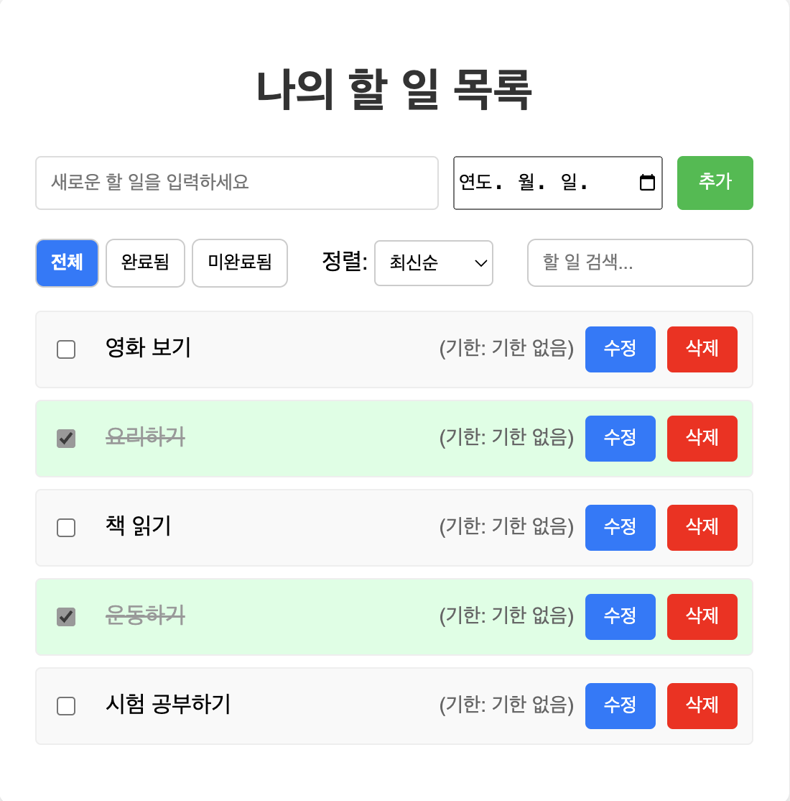
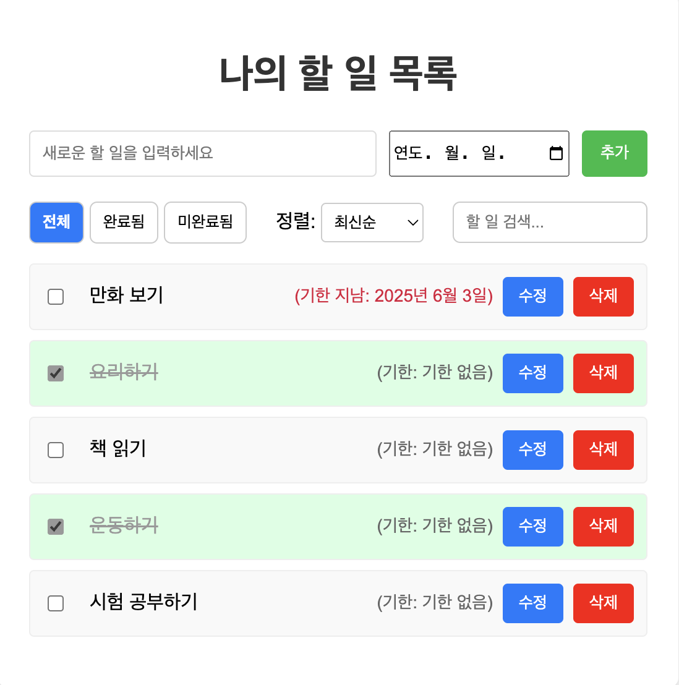

## 1. 프로젝트 정보

- **과제명:** To-Do List 업그레이드 (Version 3 → Version 4)
- **제출자:** 안서현, 김민경
- **제출일:** 2025년 06월 23일

---

## 2. 서론

- **프로젝트 목표:** 본 보고서는 기본 To-Do List (GET, POST 기능만 포함된 V3)를 시작으로, 할 일 수정, 필터링, 정렬, 검색, 기한 설정, 유효성 검사, 에러 처리 UI 등 다양한 고급 기능을 추가하여 To-Do List (V4)를 구현한 과정과 결과를 설명합니다.
- **주요 변경 사항 요약:** V3에서 V4로 넘어가면서 추가되거나 개선된 핵심 기능들을 간략하게 소개합니다. (예: `PUT`/`PATCH` 메서드 도입, 클라이언트 측 데이터 조작 등)

---

## 3. 구현 기능 목록 및 스크린샷

- **할 일 CRUD 기능:**

  - **할 일 조회 (GET)**

    

  - **할 일 추가 (POST)**

    

  - **할 일 수정 (PUT):**

    

  - **할 일 완료 상태 토글 (PATCH):**

    

  - **할 일 삭제 (DELETE)**

    

- **할 일 필터링:** (예: 전체, 완료됨, 미완료됨)
  
- **할 일 정렬:** (예: 최신순, 오래된순, 알파벳순, 기한순)
  
- **간단한 검색 기능:**
  
- **기한 설정 및 시각화:**
  - 할 일 추가/수정 시 기한 설정
    
  - 기한 초과 할 일 시각적 강조
    
- **유효성 검사:** (클라이언트/서버)
  - 클라이언트에서 유효성 검사 추가, 서버는 미들웨어로 유효성 검사
- **에러 처리 UI:** (서버 통신 실패 시 메시지 표시)
  

---

## 4. 주요 구현 내용 및 기술적 설명

### 4.1 API 디자인 (RESTful 원칙)

- **V3와 V4의 API 변화:**

  - `PATCH /api/todos/:id`
    - **사용목적** 사용자가 할 일의 완료 상태(completed)를 토글하거나, 텍스트(text), 기한(dueDate)을 부분적으로 수정할 때 사용
    - **선택 이유** PATCH는 자원의 `일부만 수정`할 때 적합한 메서드로, PUT과는 달리 전체 객체를 덮어쓸 필요가 없다는 장점이 있습니다.
    - **클라이언트**
      - 체크박스 변경 시 PATCH 요청을 전송해 완료 상태를 갱신
      - “수정” 버튼 클릭 시 텍스트와 기한 입력창이 생기며, 사용자가 변경 후 “저장”을 누르면 PATCH 요청이 전송
    - **서버**
      - validateTodoInput 미들웨어를 통해 전달된 필드만 검증
      - PATCH 요청에서는 text, completed, dueDate 중 존재하는 필드만 수정되도록 처리
      - 필드가 없거나 잘못된 형식일 경우 400 응답을 반환
  - `PUT /api/todos/:id` - 전체 리소스 교체

    현재 구현은 하지 않았지만, 향후 사용자가 텍스트, 완료 상태, 기한을 모두 수정하는 경우를 대비하여 PUT도 고려 대상

  - `DELETE /api/todos/:id`
    - **사용목적** 특정 ID의 할 일을 서버에서 `영구적`으로 삭제
    - **선택이유** RESTful API에서 특정 리소스를 제거할 때 사용하는 표준 메서드
    - **클라이언트**
      - “삭제” 버튼 클릭 시 해당 ID를 포함한 DELETE 요청을 전송
      - 삭제 성공 시 DOM에서 해당 항목을 제거하여 즉시 반영
    - **서버** 해당 ID를 가진 할 일이 존재하지 않으면 404 에러를 반환하고, 존재할 경우 JSON 파일에서 제거 후 204 No Content를 응답

- **URL 쿼리 파라미터 사용:**
  - Request 아키텍처에서는 리소스를 표현하고 필터링하거나 정렬하는 목적으로 쿼리 파라미터를 사용
  - 쿼리 파라미터 : HTTP GET 요청 시 URL에 추가되는 `?key=value` 형식의 정보로, 서버에 조건에 따른 요청을 전달할 때 사용
- 쿼리 파라미터 사용 용도
  - 4.1.1. 필터링 (Filtering)
    - 특정 조건을 만족하는 리소스만 조회하고자 할 때 사용
    - 예: `GET /api/todos?completed=false` : 완료되지 않은 할 일만 조회
  - 4.1.2. 정렬 (Sorting)
    - 특정 기준에 따라 정렬
    - 예: `GET /api/todos?sort=alpha` : 텍스트를 알파벳순으로 정렬
  - 4.1.3. 검색 (Searching)
    - 특정 키워드가 포함된 항목만 추출
    - 예시: `GET /api/todos?search=영화` : “영화”가 포함된 할 일만 조회

### 4.2 클라이언트 측 로직 구현 (public/script_v4.js)

- **할 일 수정 기능 (`PUT` 요청 관련):**
  - 수정 버튼 클릭 시 UI 설명
    - 기존 내용 제거 : 기존에 있던 체크박스, 텍스트(span), 기한 표시(span), 수정/삭제 버튼 등은 전부 제거됨
    - 텍스트 입력 필드 (할 일 내용) : 기존 할 일 내용(todo.text)이 들어간 텍스트 입력 필드를 사용자에게 기존 내용을 수정할 수 있게 한다.
    - 날짜 입력 필드 (기한 수정) : 기존에 설정된 기한 (dueDate)이 있다면 날짜 부분만 잘라서 초기값으로 설정
    - 저장 버튼 : 클릭 시 서버에 `PATCH` 요청을 보내 수정된 내용을 저장
  - **`PATCH`** 로 구현
    - 사용자는 텍스트나 기한 중 일부만 수정할 수 있기때문
    - 서버는 요청 본문에 있는 필드만 선별적으로 수정함
  - 저장 버튼 클릭 시
    - `PATCH /api/todos/:id` 요청이 발생
    - 요청 본문에는 수정된 text와 dueDate가 포함
    - 서버는 전달받은 필드만 골라 기존 todo 객체를 업데이트
- **할 일 필터링 기능:**
  - 사용자가 “완료됨” 버튼을 클릭하면 currentFilter가 "completed"로 설정
    - 전체, 완료 버튼을 클릭하면 currentFilter 값만 변경됨
  - renderTodos 함수 내부 : currentFilter의 값에 따라 completed 쿼리 파라미터가 결정됩니다.
  - 서버 요청 파라미터
    - `completed=` : 모든 할 일 반환
    - `completed = true` : 완료된 할 일만 요청
    - `completed = flase` : 미완료된 할 일만 요청
  - 서버와 상호작용
    - 이 요청은 서버의 `/api/todos` 엔드포인트로 전달되며, 서버는 completed 값에 따라 필터링된 할 일 목록을 JSON으로 반환
  - 최종 렌더링
    - renderTodos()는 서버에서 받아온 할 일 배열을 순회하며 UI를 다시 그려 사용자는 원하는 결과를 얻을 수 있음
- **할 일 정렬 기능:**
  - 드롭다운과 renderTodos연결 : 사용자가 정렬 기준을 드롭다운에서 선택하면 renderTodos() 함수가 자동으로 호출되어 정렬된 목록을 다시 렌더링합니다.
  - 정렬 기준 전달 : 선택된 정렬 기준은 쿼리 파라미터로 서버에 전달되어 서버에서 정렬 처리됩니다.
  - 서버 측 sort() 정렬 처리 : 서버 코드 (GET /api/todos)에서 받은 정렬 기준에 따라 다음과 같이 todos.sort()로 데이터를 정렬합니다.
    - `asc` 오래된 순 (ID 오름차순) : 작은 ID(=먼저 추가된 항목)가 앞에 오도록 정렬 / 가장 오래된 할 일이 제일 위에 표시됨
    - `desc` 최신 순 (ID 내림차순) : 큰 ID(=가장 최근에 추가된 항목)가 앞에 오도록 정렬 / 가장 최근 추가한 할 일이 제일 위에 표시됨
    - `alpha` 알파벳/가나다 순 : localeCompare()를 사용해 문자열을 사전순으로 정렬 / 한글도 가나다 순으로 정렬됨
    - `due` 기한 빠른 순 : 마감일이 빠른 할 일이 먼저 오도록 정렬 / 기한이 없는 할 일은 가장 뒤로 밀림
  - 흐름
    > 정렬 드롭다운 선택 >
    > renderTodos() 호출 > 선택된 값은 서버에 쿼리 파라미터로 전달 > 서버는 sort 값에 따라 sort()로 정렬된 목록을 반환 > 정렬된 결과가 클라이언트에 다시 전달되어 화면에 표시
- **간단한 검색 기능:**

  - 검색 기능 동작 개요
    - 사용자가 검색 입력 필드에 텍스트를 입력하면, 해당 텍스트가 포함된 할 일만 필터링되어 화면에 표시됩니다.
    - 이는 input 이벤트를 통해 실시간으로 반응하며, 클라이언트에서 검색어를 서버에 쿼리 파라미터로 전달하여 처리합니다.
  - 핵심 구성 요소

    입력이 바뀔 때마다 renderTodos() 함수를 호출하여 검색 결과를 즉시 반영

  - renderTodos 함수 내부 : 검색어 전달
    - `searchInput.value`에 사용자가 입력한 검색어가 담김
    - 이 값은 URL 쿼리 파라미터인 search로 서버에 전달
    - 예: /api/todos?search=공부
  - 서버에서 검색 처리
    - 서버는 받은 search 쿼리값을 이용해 `todo.text`에 해당 문자열이 포함되어 있는지 검사
    - 대소문자 구분 없이 includes()를 사용해 필터링
    - 결과적으로 검색어를 포함하는 할 일만 JSON으로 응답

- **기한 설정 및 시각화:**
  - **dueDate 필드와 &lt;input type="date"&gt; 연동**
    - 할 일 객체에 dueDate 속성 추가 : 사용자가 할 일을 입력할 때 함께 선택한 기한(날짜)을 dueDate라는 속성으로 할 일 데이터에 포함시킵니다.
    - 입력 필드와 연동 (&lt;input type="date"&gt;)
      - HTML 폼에서 날짜를 입력받기 위해 input 태그의 type="date"를 사용
      - 사용자가 선택한 날짜는 자바스크립트에서 value로 받아와 할 일 객체 생성 시 dueDate로 저장
    - 수정 기능 시 날짜 입력창
      - 수정 버튼 클릭 시 기존 할 일의 dueDate 값이 있는 경우, `날짜만 추출`하여 &lt;input type="date"&gt;의 value로 설정
  - **renderTodos()에서 기한 표시 방법**
    - 각 할 일 항목이 렌더링될 때, dueDate 값을 기반으로 날짜 정보를 화면에 시각적으로 표시
  - **기한 초과 판단 및 .overdue 클래스 적용**
    - 오늘 날짜와 비교하여 dueDate가 이미 지난 경우 `.overdue 클래스`를 추가함
    - 이 클래스를 통해 기한이 지난 할 일 항목을 시각적으로 강조

### 4.3 서버 측 로직 구현 (todos_v4.js)

- **`PUT` 라우트 구현:** `PUT /api/todos/:id` 엔드포인트가 특정 할 일의 모든 필드를 어떻게 업데이트하는지 설명합니다.
- **`PATCH` 라우트 구현 (완료 상태 토글):** `PATCH /api/todos/:id` 엔드포인트가 특정 할 일의 `completed` 필드만 어떻게 부분적으로 업데이트하는지 설명합니다.
- **유효성 검사 (`validateTodoInput` 미들웨어):**

  - 이 미들웨어는 클라이언트로부터 전달된 할 일(todo) 데이터가 올바른 형식인지 사전 검사하여, 서버의 안정성과 데이터 무결성을 확보하기 위해 사용됩니다. POST, PATCH 요청 모두에서 공통으로 작동합니다.

  - 유효성 검사 대상 필드 및 처리 로직

    - **text (할 일 내용)**

      - 검사 내용 : 문자열이 아닌 타입이거나, 문자열이지만 빈 문자열일 경우 오류
      - 처리 : PATCH 요청에서도 일부 필드만 수정하므로, text가 전달되지 않았을 경우 검사하지 않도록 `text !== undefined` 조건을 추가하여 처리

    - **dueDate (기한)**

      - 세 가지 조건을 모두 만족할 때만 검사
        - dueDate가 아예 존재하지 않는 경우는 검사하지 않음 : 필수값 아님
        - dueDate가 빈 문자열인 경우(기한 없음)도 허용
        - 값이 있는데 날짜로 변환이 안 되면 오류 반환
      - 처리 : 빈 문자열(기한 없음)은 허용하고, 빈 문자열(기한 없음)은 허용함

    - **completed (완료 여부)**
      - 검사 내용 : 값이 있는 경우와 `boolean타입`인 경우
      - 처리
        - completed가 요청에서 아예 안 들어오면 검사하지 않음 : 필수값은 아님. 부분 업데이트(PATCH) 시 유연하게 처리 가능
        - 값이 존재하는 경우, 반드시 Boolean 타입인지 확인 : 문자열 "true"나 숫자 1 같은 건 허용되지 않음

- **데이터 저장 방식:** `simple_todos_v4.json` 파일에 할 일 데이터가 어떻게 저장되는지 (JSON 형태) 간략히 설명합니다.
  - `fs.writeFile()`로 이 JSON 배열을 파일에 저장합니다.
  - simple_todos.json 파일은 할 일 데이터를 JSON 배열형태로 저장합니다.
  - 이 배열에는 각 할 일을 표현하는 객체가 하나씩 들어 있으며, 각 객체는 id(고유번호), text(할 일 내용), completed(완료 여부), dueDate(마감기한) 속성들을 가집니다.

---

## 5. 문제 해결 과정 및 어려웠던 점

(1) 수정 버튼을 누를 때마다 새로운 `<input>` 필드와 `저장` 버튼이 생성되는 로직에서, 기존 이벤트 리스너가 제거되지 않고 중첩되는 문제가 발생했습니다. 따라서 수정 버튼 클릭 후 저장을 눌러도 서버에 수정 내용이 반영되지 않았습니다.

- **원인:** 이전에 등록된 PATCH 요청 핸들러가 여전히 남아 있었고, 버튼을 여러 번 눌렀을 경우 중복된 이벤트 핸들러가 작동하면서 예기치 않게 무시되거나 실행되지 않는 상황이 생겼습니다.
  특히, 각 수정 시마다 fetch() 요청이 생성되었지만 이벤트 중첩으로 인해 정확한 PATCH 요청이 한 번만 실행되지 않음
- **해결:** 수정 로직에서 수정 버튼이 눌릴 때마다 새롭게 생성된 DOM 요소에 대해 이전의 이벤트 리스너를 제거하거나, 한번만 이벤트가 등록되도록 DOM 구조를 정리하고, 또한 수정 중인 상태에서는 다른 수정 동작이 겹치지 않도록 UI 전환 상태를 명확하게 관리하면서, fetch 요청이 중복되지 않도록 코드 흐름을 재구성해 해결

(2) 할 일 수정 기능 중 특히 날짜수정 처리 부분에서 어려움을 겪었습니다. 처음에 수정버튼을 누르면 기존 텍스트 수정은 적용되었지만, 날짜 수정은 서버에 반영되지 않는 문제가 발생했습니다.

- **원인:** input type =”date”로 만든 날짜 필드의 value를 설정할 때 todo.dueDate가 ISO 포맷으로 되어있어 value에 넣으면 브라우저에서 인식하지 못하여서 수정 후에도 기존 날짜로 유지되는 현상이 발생
- **해결:** dueDate에서 날짜만 추출하여 YYYY-MM-DD형태로 바꿔주어 저장 버튼 클릭 시 해당 날짜를 추출하여 PATCH요청 body에 포함시킴

---

## 6. 결론 및 소감

RESTful API 설계 및 사용법, JavaScript를 활용한 동적인 UI 구성, 그리고 서버와의 데이터 연동 로직을 직접 구현하면서 많은 것을 배울 수 있었습니다.
 
추후 더 발전시킨다면, 각 기능에 더 구체적인 기준을 세우고 처리하도록하게 하며, 로그인, 회원가입 기능을 추가하여 사용자의 각 개인의 투두리스트를 제공하고, 더 나아가 사용자들의 커뮤니티 기능을 추가해보고 싶습니다.
